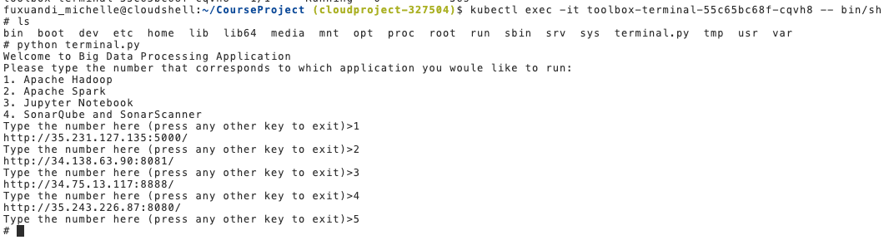

# Big_Data_Processing_Toolbox (Checkpoint)
A microservice-based application support runing Apache Hadoop, Spark, Jupyter Notebooks, SonarQube and  SonarScanner without installation
1. Docker/Terminal/*: Source Code for the main terminal application
2. Source code for all Dockerfiles that were created and URLs for all docker images on Docker Hub
  - Source code: Docker/*
  - URLs:
    - Terminal: https://hub.docker.com/r/xuandif/toolbox-terminal
    - Hadoop: https://hub.docker.com/r/xuandif/toolbox-hadoop
    - Jupyter Notebook: https://hub.docker.com/r/xuandif/toolbox-jupyter 
    - Spark: https://hub.docker.com/r/bitnami/spark
    - Sonar&SonqCube: https://hub.docker.com/r/xuandif/toolbox-sonar
3. Screenshot for the Kubernetes Engine with the containers running on it.
  
  and their corresponding load balancers,
  
  Terminal: 
  (running on cluster using ``kubectl exec -it [toolbox-terminal-55c65bc68f-cqvh8] -- bin/sh``)
  
  Jupyter Notebook:
  
  Hadoop:
  
  Spark:
  
  Sonarqube:
  
4. Steps used to run Docker images on Kubernetes Engine

    4.1. Build docker images using Dockerfiles and push to docker hub. e.g. for jupyter notebook,
      ```
      cd Docker/jupyter
      docker build -t xuandif/toolbox-jupyter .
      docker push xuandif/toolbox-jupyter
      ```
  
    4.2. Deploy applications to kubernetes, e.g. for jupyter-notebook, use the following commands
      ```
      kubectl apply -f toolbox-jupyter-deployment.yaml
      kubectl apply -f service-toolbox-jupyter-lb.yaml
      ```
      Similiar for deploying SonarQube just substitute the yaml files with its own yaml files.
      
    4.3. For deploying spark, the docker image is build directly using https://hub.docker.com/r/bitnami/spark, it can be deployed with this image to GKE through using the yaml files same as the yaml files for jupyter notebook and sonarQube.
  
    In this project, to facilitate easily deploying multiple worker, an official package was used, [Bitnami Apache Spark Chart GitHub repository](https://github.com/bitnami/charts/tree/master/bitnami/spark), referenced from the "How to deploy Apache Spark in Kubernetes?" section in [bitnami/spark](https://hub.docker.com/r/bitnami/spark) image page. Values in the value.yaml are modified to change its port. To use this package, helm has to be installed, then run with
      ```
      cd Docker & helm install spark ./spark
      ```
    4.4. For deploying hadoop, there is one more step needed, open the application in terminal by using its pod id,
      ```
        kubectl exec -it --namespace=default [hadoop-pod-id] -- bin/sh
      ```
      In the terminal, using the following command to create one master and one slave container.
      ```
        cd multinode-hadoop & ./run.sh 
      ```
     
    4.5. After deploying all applications, check external IPs for each application and update them in the terminal.py, push it to docker hub, and deploy with
       ```
       kubectl apply -f toolbox-terminal-deployment.yaml
       ```
