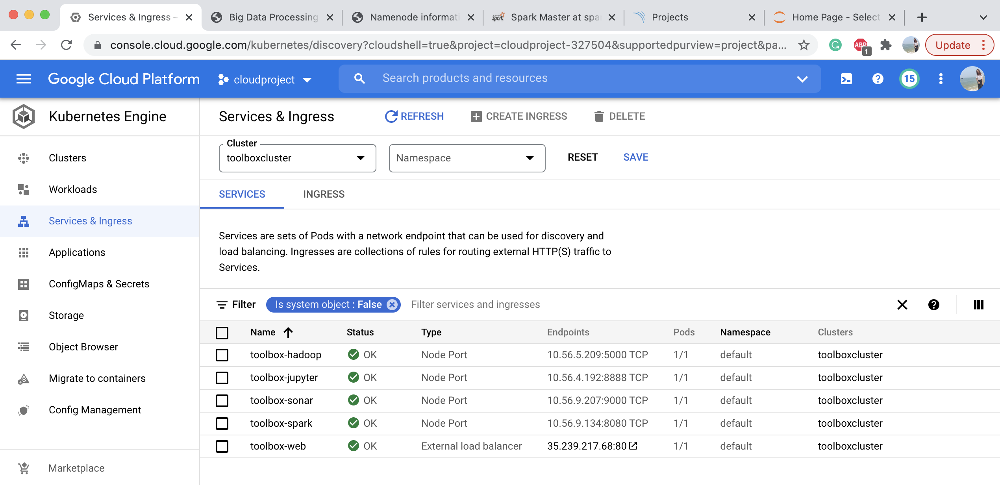

# Big_Data_Processing_Toolbox (Checkpoint)
A microservice-based application support runing Apache Hadoop, Spark, Jupyter Notebooks, SonarQube and  SonarScanner without installation
1. Docker/Terminal: Source Code for the main terminal application
2. Docker/: Source code for all Dockerfiles that were created and URLs for all docker images on Docker Hub
3. Screenshot for the Kubernetes Engine with the containers running on it.
  
  and their corresponding load balancers,
  
  application_screenshots/*.png :creenshot for running each individual application.
4. Steps you used to run Docker images on Kubernetes Engine
