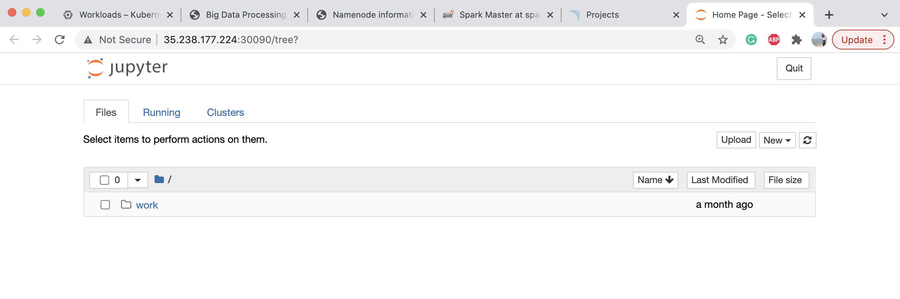
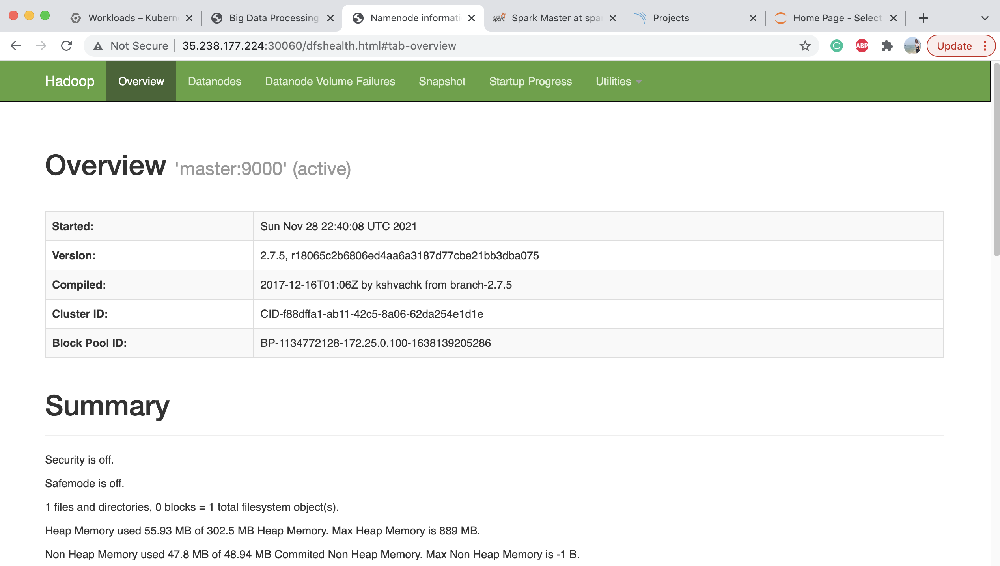
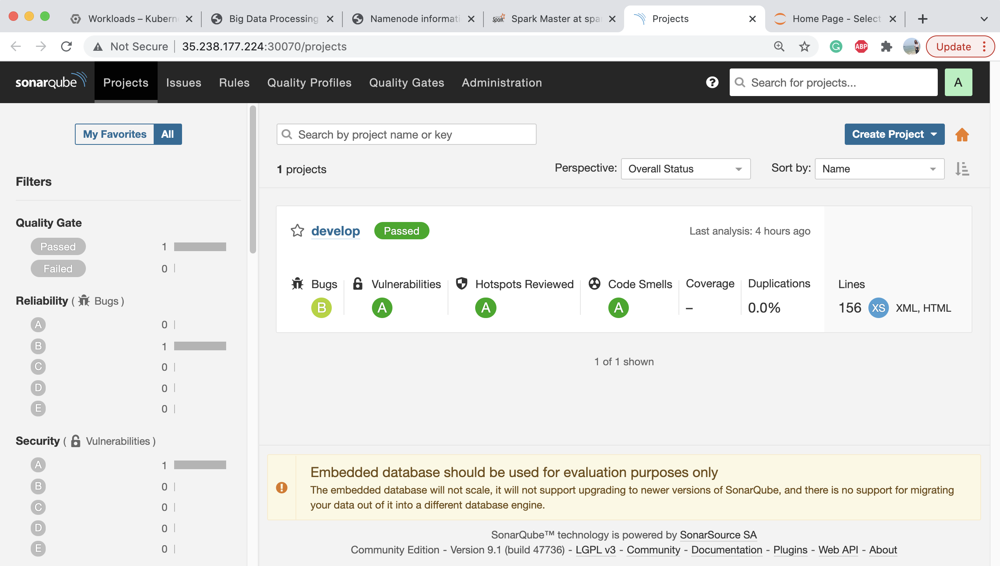

# Big_Data_Processing_Toolbox (Checkpoint)
A microservice-based application support runing Apache Hadoop, Spark, Jupyter Notebooks, SonarQube and  SonarScanner without installation
## 1. Video Code Walkthrough
  Youtube Link: https://youtu.be/nZ8R5ty7Ph8
  Google Drive Link: https://drive.google.com/file/d/1bDCBz9P_WoJDZTELb12s54eNaTA1_NcY/view?usp=sharing
## 2. Docker Images
- Docker/web/*: Source Code for the web GUI.
- Docker Images
  - Source code: Docker/*
  - URLs:
    - Web GUI: https://hub.docker.com/r/xuandif/toolbox-web:color
    - Hadoop: https://hub.docker.com/r/xuandif/toolbox-hadoop
    - Jupyter Notebook: https://hub.docker.com/r/xuandif/toolbox-jupyter 
    - Spark: https://hub.docker.com/r/bitnami/spark
    - Sonar&SonqCube: https://hub.docker.com/r/xuandif/toolbox-sonar
## 3. Screenshots
  <!-- 
  and their corresponding load balancers,
   -->
  Web GUI: 
  
  Jupyter Notebook:
  
  Hadoop:
  
  Spark:
  
  Sonarqube:
  
## 4. Steps
Steps used to build Docker images and deploy applications on Kubernetes Engine

  4.1. Build docker images using Dockerfiles and push to docker hub. All docker files are under the Docker/ directory. e.g. for jupyter notebook,
  ```
    cd Docker/jupyter
    docker build -t xuandif/toolbox-jupyter .
    docker push xuandif/toolbox-jupyter
  ```
  
  4.2. Deploy applications to kubernetes with configuration files under the GKE_Deploy/ directory, e.g. for jupyter-notebook, use commands like the following to deploy the applications and expose the service,
  ```
    cd GKE_Deploy
    kubectl apply -f toolbox-jupyter-deployment.yaml
    kubectl apply -f service-toolbox-jupyter-lb.yaml
  ```
  To deploy all of them once, the following command can be used,
  ```
    cd GKE_Deploy
    kubectl apply -f .
  ```
  Then, set up firewall rules for each service to enable access to the nodeport, using commands like,
  ```
    gcloud compute firewall-rules create toolbox-jupyter-service --allow tcp:30090
  ```
  Same steps need to be done for spark, sonarqube and hadoop.<br>
  We set up the port for services as: spark: 30080, sonarqube: 30070, hadoop: 30060 and jupyter: 30090.

  4.3. For deploying hadoop, there is one more step needed to create multinode hadoop cluster, access the pod in cloud shell terminal by using its pod name (obtained through ```kubectl get pods```),
  ```
    kubectl exec -it --namespace=default [hadoop-pod-id] -- bin/sh
  ```
  In the terminal, using the following command to create one master and two worker containers.
  ```
    cd multinode-hadoop & ./run.sh 2
  ```
     
  4.4. [Web GUI] After deploying all applications, check external IPs for each application, which will be, [IP]:[Nodeport] and update them in the index.html, build the docker image for web GUI and push it to docker hub with,
  ```
    docker build -t xuandif/toolbox-web:color .
    docker push xuandif/toolbox-web:color
  ```
  and deploy it on kubernete cluster with,
  ```
    kubectl apply -f toolbox-web-deployment.yaml
    kubectl apply -f service-toolbox-web-lb.yaml
  ```
  The following shows what the kubernete cluster contains after the deployment,
  
  Containers:
  
  Services:
  
