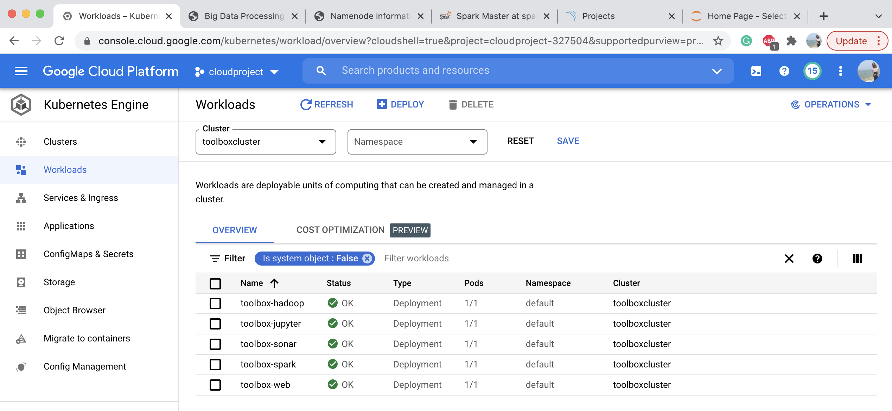

# Big_Data_Processing_Toolbox (Checkpoint)
A microservice-based application support runing Apache Hadoop, Spark, Jupyter Notebooks, SonarQube and  SonarScanner without installation
1. Docker/Terminal/*: Source Code for the main terminal application
2. Source code for all Dockerfiles that were created and URLs for all docker images on Docker Hub
  - Source code: Docker/*
  - URLs:
    - Terminal: https://hub.docker.com/r/xuandif/toolbox-terminal
    - Hadoop: https://hub.docker.com/r/xuandif/toolbox-hadoop
    - Jupyter Notebook: https://hub.docker.com/r/xuandif/toolbox-jupyter 
    - Spark: https://hub.docker.com/r/bitnami/spark
    - Sonar&SonqCube: https://hub.docker.com/r/xuandif/toolbox-sonar
3. Screenshot for the Kubernetes Engine with the containers running on it.
  
  and their corresponding load balancers,
  
  Hadoop:
  
  Spark:
  
  Jupyter Notebook:
  
  Sonarqube:
  
4. Steps used to run Docker images on Kubernetes Engine

    4.1. Build docker images using Dockerfiles and push to docker hub. e.g. for jupyter notebook,
      ```
      cd Docker/jupyter
      docker build -t xuandif/toolbox-jupyter .
      docker push xuandif/toolbox-jupyter
      ```
  
    4.2. Deploy applications to kubernetes, e.g. for jupyter-notebook, use the following commands
      ```
      kubectl apply -f toolbox-jupyter-deployment.yaml
      kubectl apply -f service-toolbox-jupyter-lb.yaml
      ```
      Similiar for deploying SonarQube and spark, just substitute the yaml files with its own yaml files.
      
    4.3. For deploying hadoop, there is one more step needed, open the application in terminal by using its pod id,
      ```
        kubectl exec -it --namespace=default [hadoop-pod-id] -- bin/sh
      ```
      In the terminal, using the following command to create one master and one slave container.
      ```
        cd multinode-hadoop & ./run.sh 
      ```
     
    4.5. After deploying all applications, check external IPs for each application and update them in the terminal.py, push it to docker hub, and deploy with
       ```
       kubectl apply -f toolbox-terminal-deployment.yaml
       ```
